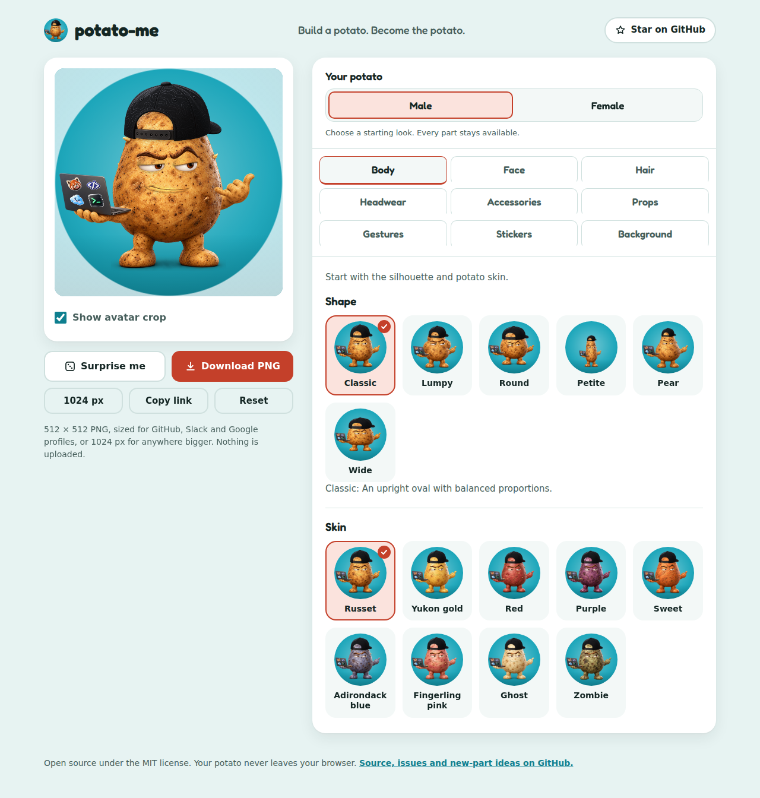

<h1 align="center">potato-me 🥔</h1>
<p align="center"><strong>A little potato. A lot of personality.</strong></p>
<p align="center">Build a potato avatar with expressive faces, fitted accessories and hand poses.</p>
<p align="center"><a href="https://potato-me.vercel.app/"><strong>Make your potato →</strong></a> · <a href="CHANGELOG.md">What's changed</a> · <a href="ROADMAP.md">What's next</a> · <a href="CONTRIBUTING.md">Contribute</a></p>

<p align="center">
  <a href="https://github.com/WaylandP/potato-me/actions/workflows/ci.yml"></a>
  <a href="LICENSE"></a>
  <a href="package.json"></a>
</p>

<p align="center"><a href="https://potato-me.vercel.app/"></a></p>

Make a profile picture for GitHub, Slack or anywhere else. Choose a body, expression, outfit and gesture, then download a **512 × 512 or 1024 × 1024 PNG** or copy a link to your creation. No account or installation is needed to use the [live editor](https://potato-me.vercel.app/).

The app combines **164 transparent PNG assets** on a Canvas in your browser. These previews are actual app output. The artwork was generated with ChatGPT image generation; its rendered appearance comes from images, not a 3D model or rig.

## Make it yours

| Customize | Included choices |
| --- | --- |
| **Body** | 4 shapes × 9 skins, including Russet, Yukon gold, Purple, Ghost and Zombie |
| **Expression** | 10 one-click vibes · 14 eyes · 7 brow styles · 12 mouths · blush or freckles · 5 facial-hair styles |
| **Headwear** | 19 hats · 12 colors for 15 recolorable hats · up to 3 characters on supported caps, beanies and headbands |
| **Held object** | 14 objects, from a laptop and coffee to pizza and a trophy · editable sign text up to 10 characters |
| **Hand pose** | 11 poses, including wave, thumbs up, peace, OK, salute and flex |
| **Accessories** | 6 eyewear styles · 6 neckwear styles · 5 extras, including headphones and earbuds |
| **Laptop stickers** | 26 designs · select up to 6 at once |
| **Background** | 14 colors · 12 patterns, including solid and spotlight |

Optional parts can be removed, and the holding hand can be left empty. Start with a vibe or **Surprise me**, then adjust the five editor tabs. Check the circular crop guide before downloading; the exported PNG itself is square. Custom text is uppercased and restricted to supported characters.

<details>
<summary><strong>See the editor</strong></summary>



</details>

## Project status

The current source version is **0.4.0**. The public-quality update rebuilds all six neckwear pieces, the backward cap, four brows, resting hands and stubble. Accessories follow the body silhouette; tall hats reframe the whole character; mustaches, monocles and eyepatches follow their facial landmarks.

The [public audit](docs/PUBLIC_AUDIT.md) records the repairs, review method and exact coverage: every source part across all four shapes and nine skins, plus expression, outfit, color and gesture matrices. Automated checks and visual inspection are recorded separately. This is a modular 2D compositor: the audit covers the documented matrices, not every possible combination of all settings. See the [roadmap](ROADMAP.md) for remaining work.

## Run locally

Use **Node.js 20 or newer**:

```bash
git clone https://github.com/WaylandP/potato-me.git
cd potato-me
npm run dev
```

Open **<http://localhost:5173>**. Running the app and its Node tests requires no `npm install` and no build step. Use an HTTP server: opening `index.html` with `file://` does not support the app's ES modules.

```bash
npm test          # State, asset integrity and renderer geometry checks
```

## How it works

The editor validates choices, loads the selected PNG layers, fits them to the body silhouette and composites them in Canvas. Skin masks match exposed limbs and facial edges to the body while preserving prop materials. Colors, sign lettering, cap initials and laptop stickers are applied at render time.

| Start here | Purpose |
| --- | --- |
| [src/main.js](src/main.js) | Editor controls, preview and downloads |
| [src/options.js](src/options.js) / [src/state.js](src/state.js) | Choices, presets, validation and share-link encoding |
| [src/raster.js](src/raster.js) / [src/surface.js](src/surface.js) | Canvas composition, body fitting and skin blending |
| [src/fit-data.js](src/fit-data.js) / [fit.html](fit.html) | Placement corrections, material masks and fitting tool |
| [assets/manifest.json](assets/manifest.json) | Inventory and checksums for all 164 source images |
| [assets/parts/](assets/parts/) / [assets/thumbs/](assets/thumbs/) | 1024 px source PNGs and generated 256 px thumbnails |
| [src/parts/](src/parts/) / [src/compose.js](src/compose.js) | SVG backgrounds, fallback stickers and the legacy SVG compositor |
| [scripts/](scripts/) / [test/](test/) | Development tools and Node tests |

The editor exports PNGs. The legacy SVG compositor remains in the codebase; it does not reproduce the rendered artwork.

### Artwork and development tools

Read [CONTRIBUTING.md](CONTRIBUTING.md) before adding or fitting a part. Option keys are part of the share-link format and must remain compatible. The [prompt guide](docs/IMAGE_PROMPTS.md), [asset-completion record](docs/ASSET_COMPLETION.md) and [fitting record](docs/CHARACTER_FITTING.md) document the artwork and its revisions.

Image maintenance tools use **Playwright with Chromium**, installed locally without changing the dependency files:

```bash
npm install --no-save --package-lock=false playwright
npx playwright install chromium

npm run assets    # Rebuild thumbnails and src/assets.js from the manifest
npm run hero      # Rebuild the banner, gallery, social preview and favicon
npm run shot -- preview.png '#item=sign&sign=SHIP%20IT&gesture=thumbsUp'
npm run audit -- /tmp/potato-audit inventory
npm run audit:ui -- /tmp/potato-ui
```

Playwright is optional development tooling. Visual changes need inspection on all four body shapes; a passing automated audit does not establish visual quality.

## Hosting and privacy

Deploy the repository root to a static host. Use **no build command** and **`.` as the publish directory**, including `assets/` and `src/`. The connected Vercel project deploys `main` to [potato-me.vercel.app](https://potato-me.vercel.app/).

Avatar composition and PNG export happen in the browser. The app has no accounts, upload endpoint, database or bundled analytics. **A share link is the save file:** its URL fragment contains the choices and custom text, and anyone with it can recreate the avatar. Use a hosted instance when sharing with others; a localhost link points to the recipient's own machine.

Fredoka is served locally from `assets/fonts/`; the editor makes no third-party requests. It still needs the static files to load, and does not install an offline service worker.

## Contributing and license

[Report a bug](https://github.com/WaylandP/potato-me/issues/new/choose) with the avatar share link, browser/device details and a screenshot when possible. Code, artwork and fitting contributions are welcome; follow the [contributor guide](CONTRIBUTING.md). Additional guidance for coding assistants is in [CLAUDE.md](CLAUDE.md).

[MIT](LICENSE), including the project's AI-generated artwork. The bundled Fredoka font retains its [SIL Open Font License](assets/fonts/OFL.txt). See [GitHub contributors](https://github.com/WaylandP/potato-me/graphs/contributors) for contribution history.
